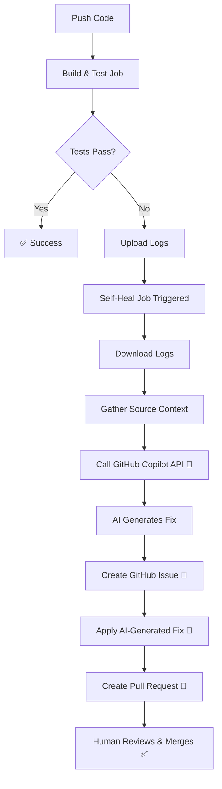

# Self-Healing CI Monorepo

A demonstration of **AI-powered** automated CI/CD self-healing capabilities using C++, Python, Bazel, and GitHub Copilot.

## Overview

This monorepo implements a **self-healing CI pipeline** that:
1. ✅ Detects flaky test failures automatically
2. 🔍 Diagnoses the root cause using **GitHub Copilot AI**
3. 🔧 Applies dynamically generated code fixes automatically
4. 📝 Creates GitHub issues for tracking
5. 🚀 Creates pull requests with AI-generated fixes

## 🆕 AI-Powered Healing

Instead of hardcoded pattern matching, this system uses **GitHub Copilot API** to:
- Analyze error logs and source code
- Generate context-aware fixes
- Adapt to any type of failure
- Learn from your codebase structure

**[Learn more about AI-Powered Self-Healing →](AI_SELF_HEALING.md)**

## Architecture

```
.
├── WORKSPACE                 # Bazel workspace configuration
├── core/                     # C++ engine implementation
│   ├── include/
│   │   └── engine.h         # Engine interface
│   ├── src/
│   │   ├── engine.cpp       # FLAKY: Simulates race condition
│   │   └── main.cpp         # Binary entry point
│   └── BUILD                # Bazel C++ targets
├── tests/                    # Integration tests
│   ├── test_integration.py  # Python observer test
│   └── BUILD                # Bazel test targets
└── .github/
    └── workflows/
        └── self-heal.yml    # Self-healing CI pipeline
```

## Components

### 1. Flaky C++ Component (`core/src/engine.cpp`)

Simulates a **race condition** that causes initialization failures:
- **Error**: `[ERROR] Resource lock timed out after 100ms.`
- **Behavior**: Fails on first initialization attempt
- **Exit Code**: Returns `1` on failure

```cpp
bool initialize() {
    // Fails on first attempt (simulating race condition)
    if (initialization_attempts == 1) {
        std::cerr << "[ERROR] Resource lock timed out after 100ms." << std::endl;
        return false;
    }
    return true;
}
```

### 2. Python Observer (`tests/test_integration.py`)

Integration test that:
- Runs the C++ binary via `subprocess`
- Asserts successful execution (exit code 0)
- **Fails** when the binary fails

### 3. AI-Powered Self-Healing Pipeline (`.github/workflows/ci.yml`)

Two-job workflow:

#### Job 1: `build-and-test`
- Builds all Bazel targets
- Runs all tests
- Uploads logs on failure

#### Job 2: `self-heal` (runs if Job 1 fails)
- Downloads failure logs
- Collects source code context
- **Calls GitHub Copilot API** to analyze and generate fix
- **Creates GitHub issue** for tracking
- **Applies** the AI-generated fix
- **Creates** a pull request with the fix linked to the issue

## 🤖 AI-Powered vs Pattern-Based

| Feature | Pattern-Based | **AI-Powered** ✨ |
|---------|--------------|------------------|
| Error Coverage | Known patterns only | **Any error type** |
| Maintenance | Manual coding | **Zero maintenance** |
| Adaptability | Fixed solutions | **Context-aware** |
| Scalability | 1 pattern = 1 rule | **Handles all** |

**See [AI_SELF_HEALING.md](AI_SELF_HEALING.md) for detailed comparison.**

## How It Works

### Initial State (Flaky)
```cpp
// BROKEN: No retry logic
bool initialize() {
    if (initialization_attempts == 1) {
        std::cerr << "[ERROR] Resource lock timed out after 100ms." << std::endl;
        return false;  // ❌ Fails immediately
    }
    return true;
}
```

### AI Analysis & Fix Generation
1. **Error Detection**: CI detects test failure
2. **Context Gathering**: Collects logs + source code
3. **AI Analysis**: GitHub Copilot analyzes the error
4. **Fix Generation**: AI generates complete fixed file
5. **Issue Creation**: Creates GitHub issue for tracking
6. **PR Creation**: Submits PR with AI-generated fix

### After AI Self-Healing (Fixed)
```cpp
// FIXED: AI-generated retry logic
bool initialize() {
    const int MAX_RETRIES = 3;
    for (int retry = 0; retry < MAX_RETRIES; retry++) {
        // ... AI-generated retry logic ...
        if (success) return true;  // ✅ Succeeds on retry
        std::this_thread::sleep_for(std::chrono::milliseconds(50));
    }
    return false;
}
```

## Running Locally

### Prerequisites
- Bazel (or Bazelisk)
- C++ compiler (GCC or Clang)
- Python 3.x

### Build and Test
```bash
# Build all targets
bazel build //...

# Run all tests
bazel test //...

# Run specific test
bazel test //tests:test_integration --test_output=all
```

### Expected Behavior

**First run:**
```
FAIL: //tests:test_integration
[ERROR] Resource lock timed out after 100ms.
```

**After fix applied:**
```
PASS: //tests:test_integration
Engine initialized successfully on attempt 2.
```

## CI/CD Flow



## Key Features

### 🤖 **AI-Powered Diagnosis**
Uses GitHub Copilot to analyze failures dynamically:
- No hardcoded patterns needed
- Adapts to any error type
- Context-aware solutions

### 🔧 **Automated Fix Application**
The fix is **not suggested** but **directly applied**:
```yaml
# AI generates complete file content
echo "$AI_GENERATED_CONTENT" > core/src/engine.cpp
```

### 📝 **Issue-First Workflow**
Creates GitHub issue before PR:
- Tracks the problem
- Links issue to PR
- Provides audit trail

### 🚀 **Automatic PR Creation**
Uses GitHub CLI (`gh`) to create detailed pull request:
- Describes the AI analysis
- Explains the solution
- Links to the tracking issue
- Includes workflow run details

## Extending the System

### Using the AI-Powered Workflow

The system automatically adapts to new error types without code changes. The AI analyzes:
- Error messages and logs
- Source code structure
- Best practices
- Codebase patterns

**No manual pattern coding needed!**

See **[AI_SELF_HEALING.md](AI_SELF_HEALING.md)** for:
- How the AI analysis works
- JSON schema for responses
- Customization options
- Fallback mechanisms

### Customizing AI Behavior

Edit `.github/workflows/ci.yml`:

```yaml
- name: GitHub Copilot Inference Fix
  env:
    COPILOT_TOKEN: ${{ secrets.GITHUB_TOKEN }}
  run: |
    # Customize the system prompt
    "content": "You are a C++ expert. Focus on performance..."
    
    # Adjust the model
    "model": "gpt-4o"  # or gpt-4-turbo
```

## Limitations & Future Enhancements

### Current Capabilities
- ✅ AI-powered dynamic fix generation
- ✅ Handles any error type
- ✅ Context-aware solutions
- ✅ Issue tracking integration
- ✅ Fallback to manual review

### Potential Enhancements
- 🔄 Multi-file fix support
- ✅ Fix verification before PR creation
- 📊 Confidence scoring from AI
- 🧪 A/B testing of multiple fix candidates
- 📚 Learning from PR review feedback
- 🔌 Integration with other AI services (OpenAI, Anthropic)
- 🎯 Automated fix benchmarking

### Known Limitations
- AI API rate limits may apply
- Complex architectural issues may need human review
- Generated fixes should always be reviewed before merging

## Real-World Applications

This pattern can be applied to:
- **Flaky tests** (timing issues, race conditions)
- **Dependency version conflicts** (auto-update compatible versions)
- **Configuration drift** (reset to known-good configs)
- **Resource exhaustion** (add retry/backoff logic)
- **Integration failures** (update API endpoints, auth tokens)

## License

MIT

## Contributing

This is a demonstration project. For production use:
1. Add comprehensive testing of the healer itself
2. Implement approval gates before auto-merging
3. Add rollback mechanisms
4. Set up monitoring and alerting
5. Create runbooks for manual intervention scenarios

---

**Built with:** C++, Python, Bazel, GitHub Actions, **GitHub Copilot AI** 🤖

**Key Innovation:** AI-powered dynamic fix generation instead of hardcoded patterns

**Documentation:**
- **[AI_SELF_HEALING.md](AI_SELF_HEALING.md)** - Complete guide to AI-powered healing
- **[HOW_IT_WORKS.md](HOW_IT_WORKS.md)** - System explanation
- **[QUICKSTART.md](QUICKSTART.md)** - Get started quickly
- **[ARCHITECTURE.md](ARCHITECTURE.md)** - Detailed architecture
- **[TESTING_CHECKLIST.md](TESTING_CHECKLIST.md)** - Testing guide
